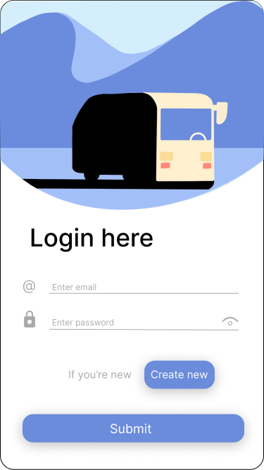

# SmartRideApp-A-smart-application-for-a-public-bus-driver
Digitalized transit has become a key part of transit accessibility and the way of movement. With its development, new terms like on-demand services and mobility as a service, MaaS emerge. On-demand service in transit represents a type of service which allows the passenger to control the main parts of the travel, while mobility as a service combines already existing solutions of public and private digitalized transit into a unique system in which the passenger is enabled to organize the travel in its entirety. In this thesis, research of existing solutions for digitalized transit has been conducted and a solution for digitalizing transit for bus drivers has been modeled. Based on the presented model, the design has been implemented in Figma and the prototype of the mobile application has been built in Flutter.

## Setup

To install and run this app you need to install Flutter and Android Studio or VS Code editor.

  - Flutter: [https://docs.flutter.dev/get-started/install](https://docs.flutter.dev/get-started/install).
  - Android Studio: [https://developer.android.com/studio/install](https://developer.android.com/studio/install)
      - Create virtual device: [https://developer.android.com/studio/run/managing-avds](https://developer.android.com/studio/run/managing-avds)

- VS Code: [https://code.visualstudio.com/](https://code.visualstudio.com/) 

## Run application in terminal

- start Android Virtual Device
- position yourself in project directory

    `cd <PROJECT_FOLDER>`

- run command to get required packages

    `flutter pub get`

- next, run application  with

    `flutter run`

- if you have more than one AVD running, you will be asked to choose on which one you want your application to run, enter number of AVD and continue

- building will take some time, few minutes at least, after building is done app will automatically start

## Application screens

  

    
    
Splash screen

  

  

    
    
Login screen

  

  

    
    
Home screen #1

  

  

    
    
Home screen #2

  

  

    
    
Request pop up

  

  

  
  

    
    
Status & weather

  

  
  

    
    
Drivers screen

  

  

    
    
History

  

  

    
    
Route list screen

  

  

    
    
Navigation screen

  

## Project architecture
Simplified project architecture overview.

 

    
    
Flutter project overview

  

